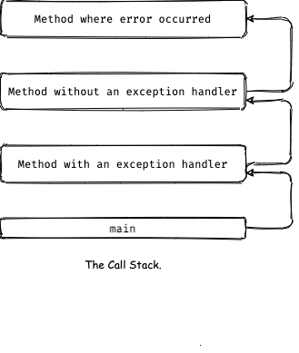
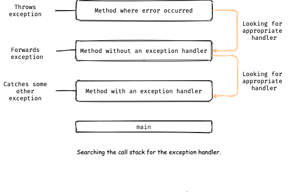
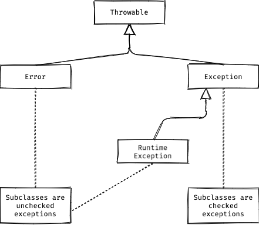

# Exceptions

## What is Exceptions?

The term **_exception_** is showrthand for the phrase "exceptional event".

> An exception is an event, which occurs during the execution of a program, that disrupts the normal flow of the program's instructions.

### Throwing an exception
When an error occures withing a method, the methods creates an object and hands it off to the runtime system. The object, called and exception object and creating this object and handing it to the runtime system is called _throwing an exception_.

### Exception Object contains
- Information about the error including its type
- State of the program when the error occurred

### Handle an exception
After a method throws an exception, the runtime system try to handle it by going through the ordered list of method also known as **_call stack_** that have been called to get to the method where the error occurred.

  

### Exception Handler
The runtime system searches the call stack for a method that contains a block of code that can handle the exception. When an appropriate handler is found, the runtime system passes the exception to the handler. An exception handler is considered appropriate if the type of the exception object thrown matches the type that can be handled by the handler.

### Catce the exception
The exception handler chosen is said to _catch the exception_. If the runtime system exhaustively searches all the methods on the call stack without finding an appropriate exception handler, as shown in the next figure, the runtime system (and, consequently, the program) terminates.

  

## The Catch or Specify Requirement
Code that might throw certain exception must be enclosed by 
- A `try` statement that catches the exception
- The method must Specify Requirement that it might throw an exception. It must provide a throws clause.

### The Three kinds of Exceptions
**Checked Excpetion:**
- These are exceptional conditions that a well-written application should anticipate and recover from.
- Checked exception are subject to catch or sepcifiy requrirementt.
- All the exceptions are checkd exception except the subclasses of `Error` and `Runtime Excpetion`.
- Example: `java.io.FileNotFoundException`, 

**Error:**
- These are exceptional condition external to application.
- Usually cannot anticipate or recover from.
- Not subject to catch or specify requirement.
- Example: `java.io.IOError`

**Runtime Exception:**
- These are exceptional condition that are internal to the application.
- Usually cannot aticipate or recover from.
- Indicate Programming bug, such as logic error or improper use of an API.
- Not subject to catch or secify requirement.
- All sub classes of runtime exceltions are also _Unchecked Exception_.
- Example: `java.lang.NullPointerException`, `java.lang.NumberFormatException`, `java.long.IllegalArgumentException`

  

